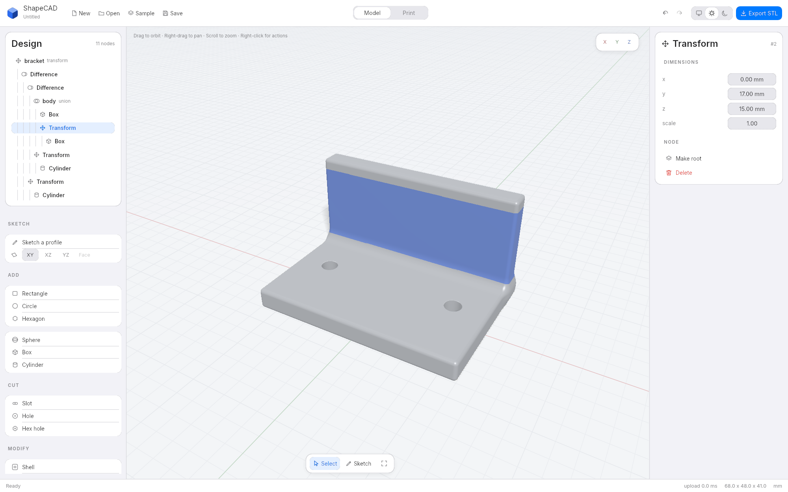

<p align="center">
  
</p>

<h1 align="center">ShapeCAD</h1>

<p align="center">
  An experimental desktop CAD app for designing parts to 3D print.<br>
  Written in Rust, with a GPU-rendered viewport and STL export.
</p>

<p align="center">
  
</p>

---

ShapeCAD is an early prototype and isn't usable yet. Basic modeling tools are
in place, but sketching, feature dependencies and mesh export still need work.

The code was written with OpenAI Codex and Claude Code, with me directing and
reviewing the work. I haven't hand-written the code.

## Implemented so far

- Draw a closed polygon on the XY, XZ or YZ plane, snap points to a grid,
  and extrude it.
- Add rectangular, circular or hexagonal pads and edit their dimensions.
  Change the hexagon's side count to make other regular polygons.
- Add spheres, boxes and cylinders, or cut rectangular, circular and hexagonal
  pockets through a part.
- Build pads and pockets on an existing pad's top surface. Attached features
  follow their supporting feature when it changes.
- Select bodies and boolean joints in the viewport or design tree, then edit
  dimensions and blend radii in the property panel.
- Apply shells and offsets, move features with numeric coordinates, and detach
  features from their supporting surface.
- Undo and redo whole modeling actions, save and open designs, and export STL.
- Choose light, dark or system appearance.

The Rust libraries also support STL and OBJ import, converting triangle meshes
into voxel distance grids for modeling operations. Import is not yet exposed in
the desktop file browser or CLI.

Numeric edits update the viewport through a GPU parameter buffer. They don't
recompile the shader unless the generated shader code changes.

## What's still rough

- Sketches have no constraint solver or arc tools. The shape buttons create
  pads immediately; there's no separate sketch editor for dimensioning a
  profile before using it in several features.
- There are no push/pull handles or direct movement tools in the viewport.
  Dimensions are edited in the side panel.
- Move starts with a 10 mm step along X, then lets you edit coordinates. For an
  attached placement, movement is stored relative to its supporting surface.
- Dimension drags can still leave several undo steps. Feature creation and
  modifiers are grouped into one step.
- Imported geometry is sampled onto a voxel grid. Its detail depends on the
  grid resolution, and it does not recover the original model's sketches or
  editable dimensions.
- Some exports have non-manifold edges. The CLI can still report these as
  manifold, so its success message isn't a guarantee. See
  [the meshing notes](docs/meshing.md).

## Run it

You'll need Rust, a C linker and a GPU driver. The Rust version is pinned in
[rust-toolchain.toml](rust-toolchain.toml). System packages and WSL setup are
covered in [the build guide](docs/building.md).

```sh
cargo run --release -p sc-app
```

Use a release build for the viewport and mesh export.

Click to select, drag to orbit, right-drag or Shift-drag to pan, and scroll to
zoom. Right-click for actions on the item under the pointer. Double-click to
focus, or press `F` to fit the model.

To try a simple part, choose **XY**, add a **Rectangle**, and set its width,
height and depth in the right panel. Use **Hole** to cut through it, then change
the hole's radius in the same panel.

To draw your own outline, choose a plane and press **Sketch a profile**. Click
points, then press Enter to close and extrude it. Backspace removes the last
point; Escape cancels.

The app has been tested on Linux, including WSL. Windows and macOS are untested.

The headless CLI can inspect and export the built-in reference part:

```sh
cargo run -p sc-cli -- demo
cargo run --release -p sc-cli -- export bracket.stl --resolution 192
cargo run -p sc-cli -- selftest
```

## How it works

ShapeCAD stores geometry as a directed acyclic graph of implicit operations.
The viewport evaluates the field on the GPU, and a dual contouring mesher turns
it into triangles for export. Imported meshes use sampled distance grids.

This makes it possible to combine shapes and blend their joins without managing
surface topology at each edit. It also comes with tradeoffs: there's no exact
NURBS geometry or STEP export, and the exported mesh depends on the meshing
resolution. The reasoning is in [the kernel design decision](docs/adr/0001-implicit-kernel.md).

The workspace has six crates:

| Crate | Purpose |
| --- | --- |
| `sc-geom` | Geometry tree, evaluation, bounds, hashing and shader generation |
| `sc-doc` | Documents, commands, undo, the file format and imported assets |
| `sc-mesh` | Dual contouring, STL export, STL/OBJ import and voxelization |
| `sc-render` | Viewport rendering and camera controls |
| `sc-app` | Desktop interface |
| `sc-cli` | Headless commands |

Document edits go through `Document::apply`, which keeps the command history
and undo behavior consistent. Commands are atomic: a rejected edit leaves the
document unchanged. This command interface is also the basis for planned agent
support.

## Design files

Designs are saved as readable `.shapecad` JSON. Parts containing imported mesh
geometry also have a companion assets directory, such as `part.assets/` beside
`part.shapecad`. Keep the file and directory together when moving or sharing a
design. Saving to a new path copies the required assets.

Undo history lasts for the current session and is not saved. See
[the file format reference](docs/file-format.md) for details.

## Development

```sh
cargo test --workspace
cargo clippy --workspace --all-targets --all-features -- -D warnings
cargo fmt --all --check
cargo run -p sc-cli -- selftest
```

Tests cover geometry evaluation, bounds, undo, meshing and rendering. Property
tests exercise randomly generated models, and the CLI's `selftest` checks a
reference part against its saved geometry hash.

Start with the [developer API reference](docs/api-reference.md) for types,
methods, commands and examples. See [CONTRIBUTING.md](CONTRIBUTING.md) for
development conventions and [docs/](docs/) for architecture and implementation
notes.

## License

ShapeCAD is licensed under the [Apache License 2.0](LICENSE).

The bundled Inter font uses the [SIL Open Font License](crates/sc-app/assets/fonts/LICENSE.txt).
